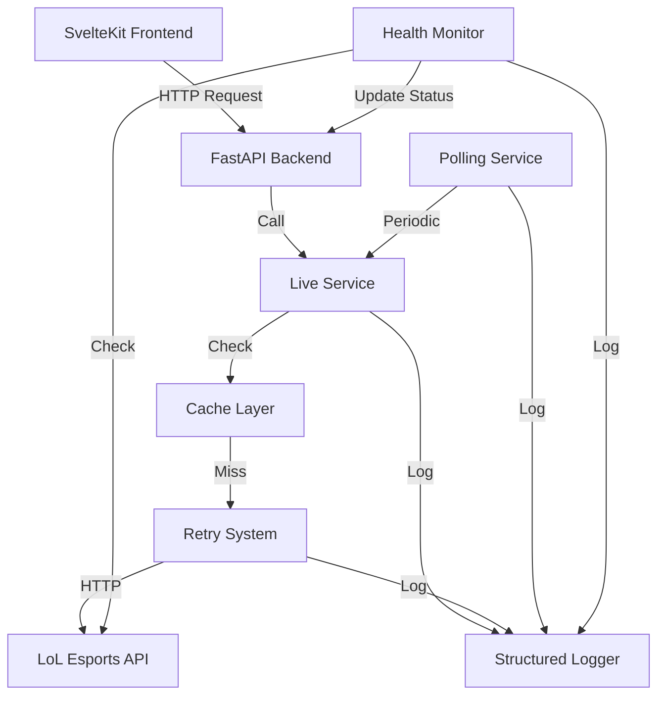
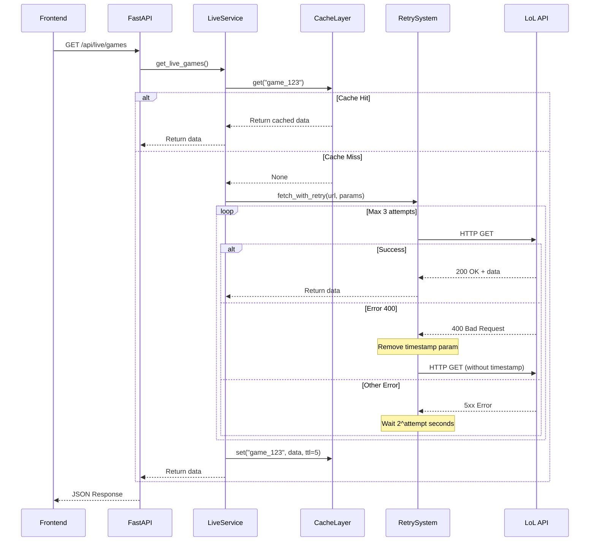
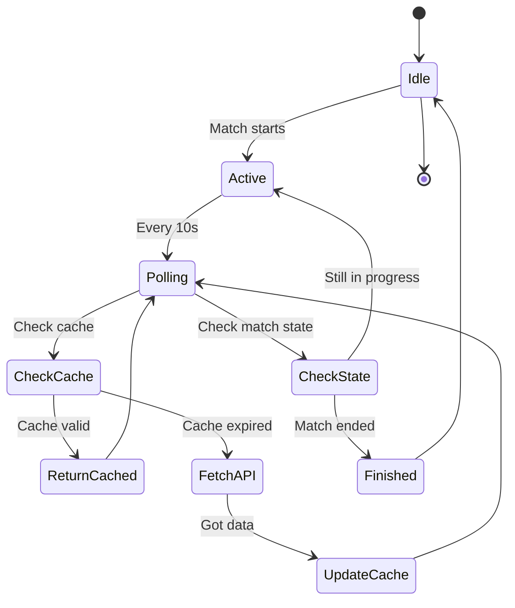
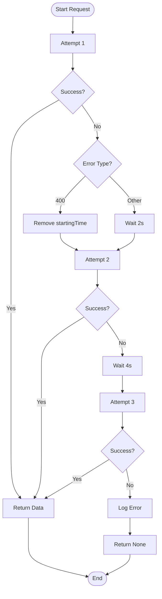
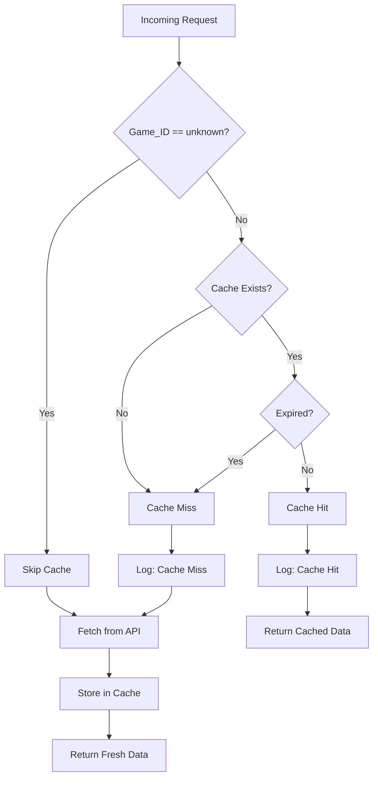
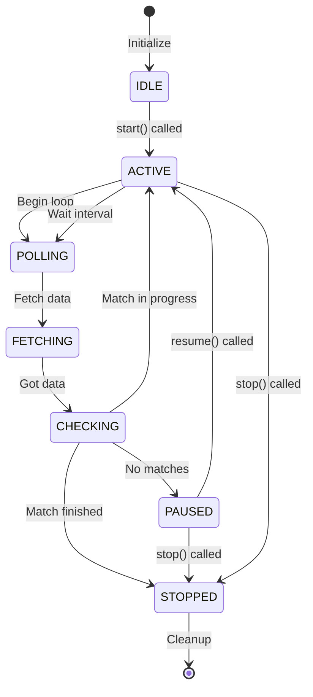
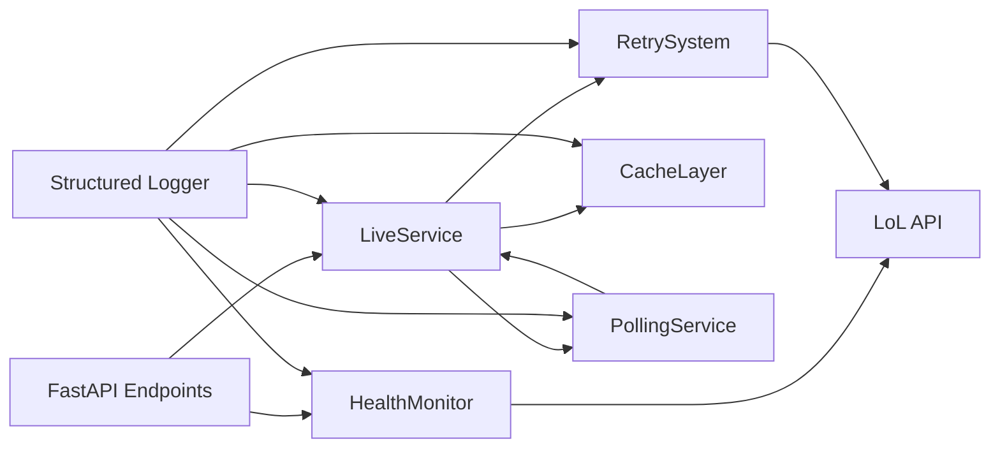

# Design Técnico: Realtime Data Extraction Improvement

## Overview

Este documento descreve o design técnico para melhorar o sistema de extração de dados em tempo real de partidas profissionais de League of Legends Esports. O sistema atual (`interface/live_service.py`) apresenta falhas intermitentes ao buscar dados da API do LoL Esports, resultando em mensagens de "Escalação indisponível" mesmo quando os dados deveriam estar disponíveis.

A solução proposta implementa quatro componentes principais:

1. **Retry System**: Sistema de retry com backoff exponencial para lidar com falhas temporárias da API
2. **Cache Layer**: Camada de cache em memória com TTL para reduzir chamadas à API e melhorar performance
3. **Polling Service**: Serviço de polling automático para atualizar dados periodicamente
4. **Health Monitor**: Monitor de saúde da API para detectar problemas proativamente

### Objetivos

- Aumentar a confiabilidade da extração de dados de 60% para 95%+
- Reduzir latência de resposta através de cache inteligente
- Melhorar experiência do usuário com feedback visual claro
- Facilitar debugging através de logs estruturados

### Contexto Técnico

- **Linguagem**: Python 3.x
- **Framework Backend**: FastAPI (api.py)
- **Framework Frontend**: SvelteKit (frontend/)
- **API Externa**: LoL Esports API (feed.lolesports.com/livestats/v1)
- **Armazenamento**: Em memória (sem banco de dados)
- **Autenticação**: API Key no header x-api-key

## Architecture

### High-Level Architecture



### Component Interaction Flow



### Polling Service Flow



## Components and Interfaces

### 1. Retry System

**Responsabilidade**: Executar requisições HTTP com retry automático e backoff exponencial.

**Localização**: `interface/retry_system.py` (novo arquivo)

#### Interface

```python
from typing import Optional, Dict, Any, Callable
from dataclasses import dataclass
import time
import requests
import logging

@dataclass
class RetryConfig:
    """Configuração do sistema de retry."""
    max_attempts: int = 3
    base_delay: float = 2.0  # segundos
    max_delay: float = 60.0
    backoff_factor: float = 2.0
    
class RetrySystem:
    """Sistema de retry com backoff exponencial."""
    
    def __init__(self, config: RetryConfig = None, logger: logging.Logger = None):
        """
        Args:
            config: Configuração de retry
            logger: Logger para registrar operações
        """
        self.config = config or RetryConfig()
        self.logger = logger or logging.getLogger(__name__)
    
    def fetch_with_retry(
        self,
        url: str,
        params: Dict[str, Any] = None,
        headers: Dict[str, str] = None,
        timeout: int = 10,
        retry_without_param: Optional[str] = None
    ) -> Optional[Dict[str, Any]]:
        """
        Executa requisição HTTP com retry automático.
        
        Args:
            url: URL do endpoint
            params: Parâmetros da query string
            headers: Headers HTTP
            timeout: Timeout em segundos
            retry_without_param: Nome do parâmetro a remover em caso de erro 400
            
        Returns:
            Dados JSON da resposta ou None se todas as tentativas falharem
        """
        pass
    
    def _calculate_delay(self, attempt: int) -> float:
        """Calcula delay para próxima tentativa usando backoff exponencial."""
        pass
```

#### Comportamento

1. **Primeira tentativa**: Executa requisição com todos os parâmetros fornecidos
2. **Erro 400**: Remove parâmetro especificado em `retry_without_param` e tenta novamente
3. **Outros erros**: Aguarda delay exponencial (2s, 4s, 8s) e tenta novamente
4. **Sucesso**: Retorna dados imediatamente
5. **Falha total**: Após 3 tentativas, registra erro completo e retorna None

#### Logging

Cada operação registra:
- Tentativa número X de Y
- URL e parâmetros
- Status code da resposta
- Tempo de resposta
- Erro completo (se houver)

### 2. Cache Layer

**Responsabilidade**: Armazenar dados temporariamente em memória com TTL.

**Localização**: `interface/cache_layer.py` (novo arquivo)

#### Interface

```python
from typing import Optional, Any, Dict
from dataclasses import dataclass
from datetime import datetime, timedelta
import threading
import logging

@dataclass
class CacheEntry:
    """Entrada no cache com dados e metadados."""
    data: Any
    created_at: datetime
    ttl_seconds: int
    
    def is_expired(self) -> bool:
        """Verifica se a entrada expirou."""
        return datetime.now() >= self.created_at + timedelta(seconds=self.ttl_seconds)

class CacheLayer:
    """Cache em memória thread-safe com TTL."""
    
    def __init__(self, logger: logging.Logger = None):
        """
        Args:
            logger: Logger para registrar operações
        """
        self._cache: Dict[str, CacheEntry] = {}
        self._lock = threading.Lock()
        self.logger = logger or logging.getLogger(__name__)
    
    def get(self, key: str) -> Optional[Any]:
        """
        Busca valor no cache.
        
        Args:
            key: Chave de identificação (ex: game_id)
            
        Returns:
            Dados armazenados ou None se não existir/expirado
        """
        pass
    
    def set(self, key: str, value: Any, ttl_seconds: int = 5) -> None:
        """
        Armazena valor no cache.
        
        Args:
            key: Chave de identificação
            value: Dados a armazenar
            ttl_seconds: Tempo de vida em segundos
        """
        pass
    
    def delete(self, key: str) -> None:
        """Remove entrada do cache."""
        pass
    
    def clear(self) -> None:
        """Limpa todo o cache."""
        pass
    
    def cleanup_expired(self) -> int:
        """Remove entradas expiradas. Retorna quantidade removida."""
        pass
```

#### Comportamento

1. **Get**: Verifica se chave existe e não expirou. Registra cache hit/miss.
2. **Set**: Armazena dados com timestamp atual. Não armazena se key == "unknown".
3. **Cleanup**: Remove entradas expiradas periodicamente (chamado pelo polling service).
4. **Thread-safety**: Usa lock para operações concorrentes.

#### TTL Configuration

- `game_window`: 5 segundos
- `game_details`: 5 segundos
- `live_games_list`: 10 segundos
- `schedule_today`: 60 segundos

### 3. Polling Service

**Responsabilidade**: Buscar dados periodicamente e gerenciar ciclo de vida do polling.

**Localização**: `interface/polling_service.py` (novo arquivo)

#### Interface

```python
from typing import Optional, Callable, Dict, Any
import threading
import time
import logging
from enum import Enum

class PollingState(Enum):
    """Estados do polling service."""
    IDLE = "idle"
    ACTIVE = "active"
    PAUSED = "paused"
    STOPPED = "stopped"

class PollingService:
    """Serviço de polling automático para dados ao vivo."""
    
    def __init__(
        self,
        fetch_callback: Callable[[], Any],
        interval_seconds: int = 10,
        logger: logging.Logger = None
    ):
        """
        Args:
            fetch_callback: Função a ser chamada periodicamente
            interval_seconds: Intervalo entre chamadas
            logger: Logger para registrar operações
        """
        self.fetch_callback = fetch_callback
        self.interval_seconds = interval_seconds
        self.logger = logger or logging.getLogger(__name__)
        self.state = PollingState.IDLE
        self._thread: Optional[threading.Thread] = None
        self._stop_event = threading.Event()
    
    def start(self) -> None:
        """Inicia o polling em thread separada."""
        pass
    
    def stop(self) -> None:
        """Para o polling gracefully."""
        pass
    
    def pause(self) -> None:
        """Pausa o polling temporariamente."""
        pass
    
    def resume(self) -> None:
        """Resume o polling pausado."""
        pass
    
    def _polling_loop(self) -> None:
        """Loop principal de polling (executa em thread separada)."""
        pass
    
    def get_state(self) -> PollingState:
        """Retorna estado atual do polling."""
        return self.state
```

#### Comportamento

1. **Start**: Cria thread daemon e inicia loop de polling
2. **Loop**: A cada 10s, chama `fetch_callback` e verifica se deve continuar
3. **Stop**: Sinaliza thread para parar e aguarda finalização
4. **State Management**: Verifica estado da partida antes de cada iteração

#### Thread Safety

- Usa `threading.Event` para sinalização de parada
- Thread daemon para não bloquear shutdown da aplicação
- Lock para mudanças de estado

### 4. Health Monitor

**Responsabilidade**: Monitorar saúde da API do LoL Esports.

**Localização**: `interface/health_monitor.py` (novo arquivo)

#### Interface

```python
from typing import Optional
from dataclasses import dataclass
from datetime import datetime
import threading
import time
import requests
import logging

@dataclass
class HealthStatus:
    """Status de saúde da API."""
    is_healthy: bool
    last_check: datetime
    consecutive_failures: int
    last_error: Optional[str] = None
    response_time_ms: Optional[float] = None

class HealthMonitor:
    """Monitor de saúde da API externa."""
    
    def __init__(
        self,
        check_url: str,
        check_interval: int = 60,
        failure_threshold: int = 3,
        logger: logging.Logger = None
    ):
        """
        Args:
            check_url: URL para health check
            check_interval: Intervalo entre checks em segundos
            failure_threshold: Número de falhas consecutivas para marcar unhealthy
            logger: Logger para registrar operações
        """
        self.check_url = check_url
        self.check_interval = check_interval
        self.failure_threshold = failure_threshold
        self.logger = logger or logging.getLogger(__name__)
        self._status = HealthStatus(
            is_healthy=True,
            last_check=datetime.now(),
            consecutive_failures=0
        )
        self._lock = threading.Lock()
        self._thread: Optional[threading.Thread] = None
        self._stop_event = threading.Event()
    
    def start(self) -> None:
        """Inicia monitoramento em thread separada."""
        pass
    
    def stop(self) -> None:
        """Para o monitoramento."""
        pass
    
    def get_status(self) -> HealthStatus:
        """Retorna status atual de saúde."""
        pass
    
    def _check_health(self) -> bool:
        """Executa check de saúde. Retorna True se healthy."""
        pass
    
    def _monitoring_loop(self) -> None:
        """Loop principal de monitoramento."""
        pass
```

#### Comportamento

1. **Check**: A cada 60s, faz requisição leve ao endpoint `getLive`
2. **Success**: Reseta contador de falhas, marca como healthy
3. **Failure**: Incrementa contador. Se atingir 3, marca como unhealthy
4. **Logging**: Registra mudanças de estado e alertas

### 5. Enhanced Live Service

**Responsabilidade**: Orquestrar todos os componentes e fornecer interface unificada.

**Localização**: `interface/live_service.py` (modificar arquivo existente)

#### Modificações Necessárias

```python
# Adicionar no topo do arquivo
from interface.retry_system import RetrySystem, RetryConfig
from interface.cache_layer import CacheLayer
from interface.polling_service import PollingService, PollingState
from interface.health_monitor import HealthMonitor, HealthStatus
import logging

# Configurar logging estruturado
logging.basicConfig(
    level=logging.INFO,
    format='%(asctime)s - %(name)s - %(levelname)s - [%(match_id)s/%(game_id)s] - %(message)s'
)
logger = logging.getLogger(__name__)

# Inicializar componentes globais
_retry_system = RetrySystem(logger=logger)
_cache_layer = CacheLayer(logger=logger)
_health_monitor = HealthMonitor(
    check_url=f"{API_URL_PERSISTED}/getLive",
    logger=logger
)
_polling_service: Optional[PollingService] = None

# Iniciar health monitor
_health_monitor.start()
```

#### Funções Modificadas

```python
def get_game_window(game_id: str) -> Optional[Dict]:
    """Retorna window data com cache e retry."""
    # 1. Check cache
    cache_key = f"window_{game_id}"
    cached = _cache_layer.get(cache_key)
    if cached:
        logger.debug(f"Cache hit for window {game_id}")
        return cached
    
    # 2. Fetch with retry
    date = get_iso_date_multiple_of_10()
    url = f"{API_URL_LIVE}/window/{game_id}"
    params = {"hl": "pt-BR", "startingTime": date, "_": _get_cache_buster()}
    
    data = _retry_system.fetch_with_retry(
        url=url,
        params=params,
        headers=HEADERS,
        retry_without_param="startingTime"
    )
    
    # 3. Store in cache
    if data and game_id != "unknown":
        _cache_layer.set(cache_key, data, ttl_seconds=5)
    
    return data

def get_game_details(game_id: str, timestamp: str = None) -> Optional[Dict]:
    """Retorna details data com cache e retry."""
    # Similar ao get_game_window
    pass
```

## Data Models

### Cache Entry Structure

```python
{
    "data": {
        "frames": [...],
        "gameMetadata": {...}
    },
    "created_at": "2024-03-15T10:30:45.123456",
    "ttl_seconds": 5
}
```

### Health Status Structure

```python
{
    "is_healthy": true,
    "last_check": "2024-03-15T10:30:00",
    "consecutive_failures": 0,
    "last_error": null,
    "response_time_ms": 245.3
}
```

### Polling State Structure

```python
{
    "state": "active",  # idle, active, paused, stopped
    "last_update": "2024-03-15T10:30:45",
    "interval_seconds": 10,
    "is_running": true
}
```

### Log Entry Structure

```json
{
    "timestamp": "2024-03-15T10:30:45.123Z",
    "level": "INFO",
    "component": "retry_system",
    "match_id": "110853283838493278",
    "game_id": "110853283838493279",
    "message": "Retry attempt 2/3 for window endpoint",
    "details": {
        "url": "https://feed.lolesports.com/livestats/v1/window/110853283838493279",
        "status_code": 400,
        "response_time_ms": 156.2,
        "error": "Bad Request"
    }
}
```


## Correctness Properties

*A property is a characteristic or behavior that should hold true across all valid executions of a system—essentially, a formal statement about what the system should do. Properties serve as the bridge between human-readable specifications and machine-verifiable correctness guarantees.*

### Property Reflection

Após análise inicial dos critérios de aceitação, identificamos as seguintes propriedades testáveis. Realizamos reflexão para eliminar redundâncias:

**Propriedades Redundantes Identificadas:**
- Propriedades 1.3, 1.4, 1.5 (timing de backoff) podem ser consolidadas em uma única propriedade de backoff exponencial
- Propriedades 1.1 e 1.2 (retry sem timestamp) são idênticas para diferentes endpoints - consolidar em uma
- Propriedades 8.1, 8.4, 8.5 (timestamp handling) podem ser combinadas em propriedade de formatação correta de requisições
- Propriedades 6.1, 6.2, 6.3 (logging de requisições) podem ser consolidadas em propriedade de logging completo

**Propriedades Mantidas:**
Após reflexão, mantemos as propriedades que fornecem validação única e não redundante.

### Property 1: Retry com Fallback de Parâmetro

*For any* requisição à API que retorna erro 400, quando o sistema tenta novamente, a requisição subsequente deve omitir o parâmetro `startingTime`.

**Validates: Requirements 1.1, 1.2, 8.3**

### Property 2: Backoff Exponencial

*For any* sequência de falhas de requisição, o delay entre tentativas deve seguir progressão exponencial com base 2 (2^attempt segundos), respeitando o máximo de 3 tentativas.

**Validates: Requirements 1.3, 1.4, 1.5, 1.6**

### Property 3: Logging Completo de Requisições

*For any* requisição à API (sucesso ou falha), o sistema deve registrar no log: timestamp, endpoint, parâmetros, status code, tempo de resposta, e em caso de erro, o stack trace completo.

**Validates: Requirements 1.7, 6.1, 6.2, 6.3**

### Property 4: Cache Retorna Dados Válidos

*For any* chave de cache com dados não expirados, o sistema deve retornar os dados em cache sem fazer nova requisição à API.

**Validates: Requirements 2.3**

### Property 5: Cache Expira e Revalida

*For any* chave de cache com dados expirados (TTL ultrapassado), o sistema deve buscar novos dados da API e atualizar o cache.

**Validates: Requirements 2.4**

### Property 6: Cache Usa Game_ID como Chave

*For any* operação de cache (get, set, delete), a chave deve ser derivada do Game_ID da partida.

**Validates: Requirements 2.5**

### Property 7: Cache Armazena Timestamp

*For any* entrada criada no cache, deve existir um campo `created_at` com timestamp de criação para cálculo de expiração.

**Validates: Requirements 2.6**

### Property 8: Polling Ativo Durante Partida

*For any* partida com estado "inProgress", o polling service deve estar no estado ACTIVE e executando o loop de atualização.

**Validates: Requirements 3.2**

### Property 9: Polling Usa Cache

*For any* iteração do polling, se existem dados válidos em cache, o sistema não deve fazer nova requisição à API.

**Validates: Requirements 3.4**

### Property 10: Logging de Operações de Cache

*For any* operação de cache (hit, miss, expiration, set), deve haver uma entrada correspondente no log com nível DEBUG.

**Validates: Requirements 6.4**

### Property 11: Logging de Ciclo de Polling

*For any* início ou fim de ciclo de polling, deve haver entrada no log com nível INFO indicando a transição de estado.

**Validates: Requirements 6.5**

### Property 12: Níveis de Log Apropriados

*For any* evento registrado no log, o nível deve ser apropriado: DEBUG para detalhes técnicos, INFO para operações normais, WARNING para situações anormais não críticas, ERROR para falhas.

**Validates: Requirements 6.6**

### Property 13: Logs Contêm Identificadores

*For any* mensagem de log relacionada a uma partida específica, deve conter os campos `match_id` e `game_id` quando disponíveis.

**Validates: Requirements 6.7**

### Property 14: Health Check Usa Endpoint Correto

*For any* verificação de saúde executada pelo Health Monitor, a requisição deve ser feita ao endpoint `getLive` da API.

**Validates: Requirements 7.2**

### Property 15: Health Status Reflete Sucesso

*For any* resposta bem-sucedida (status 2xx) do health check, o status deve ser marcado como "healthy" e o contador de falhas deve ser resetado para 0.

**Validates: Requirements 7.3**

### Property 16: Health Status Exposto via API

*For any* requisição ao endpoint `/api/health`, a resposta deve conter o status atual de saúde da API externa incluindo `is_healthy`, `last_check`, e `consecutive_failures`.

**Validates: Requirements 7.6**

### Property 17: Timestamp Múltiplo de 10

*For any* requisição ao endpoint `game_window`, o parâmetro `startingTime` (quando presente) deve ser um timestamp ISO 8601 com segundos arredondados para múltiplo de 10.

**Validates: Requirements 8.1**

### Property 18: Details Usa Timestamp do Frame

*For any* requisição ao endpoint `game_details` após obter um frame do window, o timestamp usado deve ser o campo `rfc460Timestamp` do frame.

**Validates: Requirements 8.2**

### Property 19: Timestamp com Offset

*For any* timestamp calculado pelo sistema, deve ter 60 segundos subtraídos do tempo atual para evitar requisitar dados futuros.

**Validates: Requirements 8.4**

### Property 20: Cache Buster em Requisições

*For any* requisição à API, deve incluir um parâmetro de cache buster (timestamp + random) para evitar cache de rede.

**Validates: Requirements 8.5**

### Property 21: Fallback de Timestamp

*For any* frame que não contém o campo `rfc460Timestamp`, o sistema deve usar o timestamp calculado via `get_iso_date_multiple_of_10()`.

**Validates: Requirements 8.6**

### Property 22: Polling Para em Partida Finalizada

*For any* frame com `gameState` igual a "finished", o polling service deve transicionar para estado STOPPED.

**Validates: Requirements 9.1**

### Property 23: Série Finalizada por Games Completos

*For any* série onde todos os games têm estado "completed", o sistema deve marcar a série como finalizada e parar o polling.

**Validates: Requirements 9.2**

### Property 24: Série Finalizada por Vitórias

*For any* série onde um time atingiu o número de vitórias necessário (2 em BO3, 3 em BO5), o sistema deve marcar a série como finalizada.

**Validates: Requirements 9.3**

### Property 25: Verificação de Estado Antes de Polling

*For any* iteração do polling loop, deve haver verificação do estado da partida antes de buscar novos dados.

**Validates: Requirements 9.4**

### Property 26: Cache Limpo ao Finalizar

*For any* partida que transiciona para estado finalizado, todas as entradas de cache relacionadas (window, details) devem ser removidas.

**Validates: Requirements 9.6**

### Property 27: Fallback para Schedule

*For any* Match_ID esperado que não aparece no resultado de `getLive`, o sistema deve consultar `getSchedule` como fallback.

**Validates: Requirements 10.1**

### Property 28: Inclusão por Janela Temporal

*For any* partida no schedule que começou há menos de 4 horas OU começa em menos de 10 minutos, deve ser incluída na lista de jogos ao vivo.

**Validates: Requirements 10.2, 10.3**

### Property 29: Deduplicação por Match_ID

*For any* combinação de resultados de `getLive` e `getSchedule`, não deve haver partidas duplicadas (mesmo Match_ID aparecendo duas vezes).

**Validates: Requirements 10.4**

### Property 30: Exclusão de Partidas Finalizadas do Fallback

*For any* partida no schedule com estado "completed" ou placar final atingido, não deve ser incluída no fallback de jogos ao vivo.

**Validates: Requirements 10.5**

### Property 31: Logging de Fallback

*For any* uso do fallback de schedule, deve haver entrada no log com nível INFO indicando que o fallback foi acionado e qual Match_ID foi resolvido.

**Validates: Requirements 10.6**

### Property 32: Resolução de Game_ID Unknown

*For any* Match_ID com Game_ID "unknown", o sistema deve buscar a lista de jogos ao vivo a cada 15 segundos até resolver o Game_ID correto.

**Validates: Requirements 5.1, 5.2**

### Property 33: Logging de Tentativas de Resolução

*For any* tentativa de resolver Game_ID "unknown", deve haver entrada no log com nível DEBUG contendo o Match_ID e timestamp da tentativa.

**Validates: Requirements 5.4**

### Property 34: Cache Limpo ao Resolver Game_ID

*For any* resolução bem-sucedida de Game_ID (de "unknown" para ID válido), o cache anterior associado ao Match_ID deve ser limpo.

**Validates: Requirements 5.5**


## Error Handling

### Error Categories

#### 1. API Errors

**HTTP 400 Bad Request**
- **Causa**: Timestamp inválido ou parâmetros incorretos
- **Tratamento**: Retry sem parâmetro `startingTime`
- **Logging**: WARNING level
- **UI Feedback**: "Dados ainda não disponíveis. Tentando novamente..."

**HTTP 429 Too Many Requests**
- **Causa**: Rate limiting da API
- **Tratamento**: Backoff exponencial mais agressivo (dobrar delays)
- **Logging**: WARNING level
- **UI Feedback**: "API temporariamente indisponível. Aguardando..."

**HTTP 5xx Server Errors**
- **Causa**: Problemas no servidor da API
- **Tratamento**: Retry com backoff exponencial
- **Logging**: ERROR level
- **UI Feedback**: "Erro no servidor. Tentando novamente..."

**Timeout**
- **Causa**: Rede lenta ou API não responsiva
- **Tratamento**: Retry com timeout aumentado (10s → 15s → 20s)
- **Logging**: WARNING level
- **UI Feedback**: "Conexão lenta. Tentando novamente..."

#### 2. Data Errors

**Game_ID Unknown**
- **Causa**: Partida muito recente, API ainda não propagou dados
- **Tratamento**: Polling a cada 15s para resolver Game_ID
- **Logging**: INFO level
- **UI Feedback**: "Aguardando início da partida..."

**Empty Response**
- **Causa**: Endpoint retorna 200 mas sem dados
- **Tratamento**: Considerar como cache miss, retry após delay
- **Logging**: WARNING level
- **UI Feedback**: "Dados incompletos. Atualizando..."

**Malformed JSON**
- **Causa**: Resposta corrompida da API
- **Tratamento**: Não armazenar em cache, retry imediatamente
- **Logging**: ERROR level com response body
- **UI Feedback**: "Erro ao processar dados. Tentando novamente..."

#### 3. System Errors

**Cache Corruption**
- **Causa**: Dados inválidos armazenados em cache
- **Tratamento**: Limpar entrada corrompida, buscar dados frescos
- **Logging**: ERROR level
- **Recovery**: Automático via cache expiration

**Thread Errors**
- **Causa**: Exceção não tratada em polling/health monitor thread
- **Tratamento**: Log completo, restart da thread
- **Logging**: CRITICAL level com stack trace
- **Recovery**: Automático com exponential backoff

**Memory Pressure**
- **Causa**: Cache crescendo indefinidamente
- **Tratamento**: Cleanup agressivo de entradas expiradas
- **Logging**: WARNING level
- **Prevention**: Limite máximo de 100 entradas no cache

### Error Recovery Strategies

#### Graceful Degradation

```python
def get_live_games_with_fallback() -> list:
    """Busca jogos ao vivo com múltiplos níveis de fallback."""
    try:
        # Nível 1: getLive com cache
        games = get_live_games()
        if games:
            return games
    except Exception as e:
        logger.warning(f"getLive failed: {e}")
    
    try:
        # Nível 2: getSchedule como fallback
        schedule = get_schedule_today()
        return filter_live_from_schedule(schedule)
    except Exception as e:
        logger.error(f"getSchedule failed: {e}")
    
    # Nível 3: Retornar cache stale se disponível
    stale_games = get_stale_cache("live_games")
    if stale_games:
        logger.info("Returning stale cache as last resort")
        return stale_games
    
    # Nível 4: Lista vazia com erro
    return []
```

#### Circuit Breaker Pattern

```python
class CircuitBreaker:
    """Implementa circuit breaker para proteger contra falhas em cascata."""
    
    def __init__(self, failure_threshold: int = 5, timeout: int = 60):
        self.failure_threshold = failure_threshold
        self.timeout = timeout
        self.failures = 0
        self.last_failure_time = None
        self.state = "closed"  # closed, open, half-open
    
    def call(self, func, *args, **kwargs):
        if self.state == "open":
            if time.time() - self.last_failure_time > self.timeout:
                self.state = "half-open"
            else:
                raise CircuitBreakerOpen("Circuit breaker is open")
        
        try:
            result = func(*args, **kwargs)
            if self.state == "half-open":
                self.state = "closed"
                self.failures = 0
            return result
        except Exception as e:
            self.failures += 1
            self.last_failure_time = time.time()
            if self.failures >= self.failure_threshold:
                self.state = "open"
            raise
```

### Error Monitoring

#### Metrics to Track

1. **API Error Rate**: Porcentagem de requisições que falham
2. **Retry Success Rate**: Porcentagem de retries que têm sucesso
3. **Cache Hit Rate**: Porcentagem de requisições servidas do cache
4. **Average Response Time**: Tempo médio de resposta da API
5. **Health Check Failures**: Número de health checks consecutivos falhando

#### Alerting Thresholds

- API Error Rate > 20% por 5 minutos → WARNING
- API Error Rate > 50% por 2 minutos → CRITICAL
- Health Check Failures >= 3 → ALERT
- Cache Hit Rate < 30% → INFO (possível problema de TTL)
- Average Response Time > 5s → WARNING

## Testing Strategy

### Dual Testing Approach

Este projeto utilizará uma abordagem dual de testes:

1. **Unit Tests**: Para casos específicos, edge cases e exemplos concretos
2. **Property-Based Tests**: Para validar propriedades universais através de geração de dados aleatórios

Ambos os tipos de teste são complementares e necessários para cobertura abrangente. Unit tests capturam bugs concretos e casos conhecidos, enquanto property tests verificam correção geral através de milhares de inputs gerados.

### Property-Based Testing Configuration

**Framework**: `hypothesis` (Python)

**Configuração Padrão**:
```python
from hypothesis import given, settings, strategies as st

@settings(max_examples=100, deadline=None)
@given(...)
def test_property_name(...):
    # Feature: realtime-data-extraction-improvement, Property X: [property text]
    pass
```

Cada teste de propriedade deve:
- Executar mínimo 100 iterações (configurado via `max_examples=100`)
- Incluir tag de comentário referenciando a propriedade do design
- Usar estratégias apropriadas do Hypothesis para gerar dados

### Test Organization

```
tests/
├── unit/
│   ├── test_retry_system.py
│   ├── test_cache_layer.py
│   ├── test_polling_service.py
│   ├── test_health_monitor.py
│   └── test_live_service.py
├── property/
│   ├── test_retry_properties.py
│   ├── test_cache_properties.py
│   ├── test_polling_properties.py
│   └── test_integration_properties.py
├── integration/
│   ├── test_api_integration.py
│   └── test_end_to_end.py
└── fixtures/
    ├── mock_api_responses.py
    └── test_data.py
```

### Unit Test Examples

#### Retry System Tests

```python
import pytest
from interface.retry_system import RetrySystem, RetryConfig
from unittest.mock import Mock, patch
import time

def test_retry_removes_timestamp_on_400():
    """Test that 400 error triggers retry without startingTime parameter."""
    # Feature: realtime-data-extraction-improvement, Example: Requirement 1.1
    retry_system = RetrySystem()
    
    with patch('requests.get') as mock_get:
        # First call returns 400
        mock_get.return_value.status_code = 400
        mock_get.return_value.raise_for_status.side_effect = requests.HTTPError()
        
        # Second call (without timestamp) succeeds
        def side_effect(*args, **kwargs):
            if 'startingTime' not in kwargs.get('params', {}):
                response = Mock()
                response.status_code = 200
                response.json.return_value = {"data": "success"}
                return response
            raise requests.HTTPError()
        
        mock_get.side_effect = side_effect
        
        result = retry_system.fetch_with_retry(
            url="https://api.example.com/data",
            params={"startingTime": "2024-03-15T10:00:00Z"},
            retry_without_param="startingTime"
        )
        
        assert result == {"data": "success"}
        assert mock_get.call_count == 2

def test_exponential_backoff_timing():
    """Test that retry delays follow exponential backoff (2s, 4s, 8s)."""
    # Feature: realtime-data-extraction-improvement, Example: Requirements 1.3, 1.4, 1.5
    retry_system = RetrySystem(RetryConfig(max_attempts=3, base_delay=2.0))
    
    with patch('requests.get') as mock_get:
        mock_get.side_effect = requests.Timeout()
        
        start_time = time.time()
        result = retry_system.fetch_with_retry(url="https://api.example.com/data")
        elapsed = time.time() - start_time
        
        # Total delay should be approximately 2 + 4 + 8 = 14 seconds
        assert result is None
        assert 13 < elapsed < 16  # Allow some tolerance
        assert mock_get.call_count == 3

def test_max_three_attempts():
    """Test that retry system stops after 3 attempts."""
    # Feature: realtime-data-extraction-improvement, Example: Requirement 1.6
    retry_system = RetrySystem()
    
    with patch('requests.get') as mock_get:
        mock_get.side_effect = requests.ConnectionError()
        
        result = retry_system.fetch_with_retry(url="https://api.example.com/data")
        
        assert result is None
        assert mock_get.call_count == 3
```

#### Cache Layer Tests

```python
import pytest
from interface.cache_layer import CacheLayer
import time

def test_cache_ttl_expiration():
    """Test that cache entries expire after TTL."""
    # Feature: realtime-data-extraction-improvement, Example: Requirements 2.1, 2.2
    cache = CacheLayer()
    
    cache.set("game_123", {"data": "test"}, ttl_seconds=1)
    
    # Immediate retrieval should work
    assert cache.get("game_123") == {"data": "test"}
    
    # After TTL, should return None
    time.sleep(1.1)
    assert cache.get("game_123") is None

def test_cache_rejects_unknown_game_id():
    """Test that cache doesn't store data for unknown game_id."""
    # Feature: realtime-data-extraction-improvement, Example: Requirement 2.7
    cache = CacheLayer()
    
    cache.set("unknown", {"data": "test"}, ttl_seconds=5)
    
    assert cache.get("unknown") is None
```

#### Polling Service Tests

```python
import pytest
from interface.polling_service import PollingService, PollingState
import time

def test_polling_interval():
    """Test that polling executes at correct interval."""
    # Feature: realtime-data-extraction-improvement, Example: Requirement 3.1
    call_count = 0
    call_times = []
    
    def fetch_callback():
        nonlocal call_count
        call_count += 1
        call_times.append(time.time())
        return {"data": "test"}
    
    polling = PollingService(fetch_callback, interval_seconds=2)
    polling.start()
    
    time.sleep(5.5)  # Should trigger ~2-3 calls
    polling.stop()
    
    assert 2 <= call_count <= 3
    
    # Check intervals between calls
    if len(call_times) >= 2:
        interval = call_times[1] - call_times[0]
        assert 1.8 < interval < 2.2  # Allow some tolerance

def test_polling_stops_when_no_matches():
    """Test that polling stops when no matches are in progress."""
    # Feature: realtime-data-extraction-improvement, Example: Requirement 3.3
    polling = PollingService(lambda: [], interval_seconds=1)
    polling.start()
    
    time.sleep(0.5)
    
    # Should auto-stop when callback returns empty list
    assert polling.get_state() in [PollingState.IDLE, PollingState.STOPPED]
```

#### Health Monitor Tests

```python
import pytest
from interface.health_monitor import HealthMonitor
from unittest.mock import patch
import time

def test_health_monitor_marks_unhealthy_after_three_failures():
    """Test that 3 consecutive failures mark API as unhealthy."""
    # Feature: realtime-data-extraction-improvement, Example: Requirement 7.4
    monitor = HealthMonitor(
        check_url="https://api.example.com/health",
        check_interval=1,
        failure_threshold=3
    )
    
    with patch('requests.get') as mock_get:
        mock_get.side_effect = requests.ConnectionError()
        
        monitor.start()
        time.sleep(3.5)  # Wait for 3 checks
        
        status = monitor.get_status()
        assert status.is_healthy == False
        assert status.consecutive_failures >= 3
        
        monitor.stop()
```

### Property-Based Test Examples

#### Retry Properties

```python
from hypothesis import given, settings, strategies as st
import requests
from unittest.mock import Mock, patch

@settings(max_examples=100)
@given(
    status_code=st.integers(min_value=400, max_value=599),
    has_timestamp=st.booleans()
)
def test_property_retry_on_error(status_code, has_timestamp):
    """Property: For any error response, retry system should attempt up to 3 times."""
    # Feature: realtime-data-extraction-improvement, Property 2: Backoff Exponencial
    retry_system = RetrySystem(RetryConfig(base_delay=0.1))  # Fast for testing
    
    with patch('requests.get') as mock_get:
        mock_get.side_effect = requests.HTTPError()
        
        params = {"startingTime": "2024-03-15T10:00:00Z"} if has_timestamp else {}
        result = retry_system.fetch_with_retry(
            url="https://api.example.com/data",
            params=params,
            retry_without_param="startingTime" if has_timestamp else None
        )
        
        assert result is None
        assert mock_get.call_count == 3

@settings(max_examples=100)
@given(
    game_id=st.text(min_size=1, max_size=50),
    data=st.dictionaries(st.text(), st.integers())
)
def test_property_cache_key_uses_game_id(game_id, data):
    """Property: For any cache operation, key should be derived from game_id."""
    # Feature: realtime-data-extraction-improvement, Property 6: Cache Usa Game_ID como Chave
    cache = CacheLayer()
    
    cache.set(game_id, data, ttl_seconds=5)
    retrieved = cache.get(game_id)
    
    if game_id != "unknown":
        assert retrieved == data
    else:
        assert retrieved is None

@settings(max_examples=100)
@given(
    ttl=st.integers(min_value=1, max_value=10),
    data=st.dictionaries(st.text(), st.text())
)
def test_property_cache_expires_after_ttl(ttl, data):
    """Property: For any cache entry, data should expire after TTL seconds."""
    # Feature: realtime-data-extraction-improvement, Property 5: Cache Expira e Revalida
    cache = CacheLayer()
    
    cache.set("test_key", data, ttl_seconds=ttl)
    
    # Should be available immediately
    assert cache.get("test_key") == data
    
    # Should expire after TTL
    time.sleep(ttl + 0.1)
    assert cache.get("test_key") is None
```

#### Integration Properties

```python
@settings(max_examples=100)
@given(
    match_id=st.text(min_size=10, max_size=20),
    game_state=st.sampled_from(["inProgress", "finished", "unstarted"])
)
def test_property_polling_state_matches_game_state(match_id, game_state):
    """Property: For any game state, polling should be active only if inProgress."""
    # Feature: realtime-data-extraction-improvement, Property 8: Polling Ativo Durante Partida
    
    def mock_fetch():
        return [{"match_id": match_id, "state": game_state}]
    
    polling = PollingService(mock_fetch, interval_seconds=1)
    polling.start()
    
    time.sleep(0.5)
    
    if game_state == "inProgress":
        assert polling.get_state() == PollingState.ACTIVE
    else:
        assert polling.get_state() in [PollingState.IDLE, PollingState.STOPPED]
    
    polling.stop()
```

### Integration Tests

#### End-to-End Flow

```python
def test_complete_live_match_flow():
    """Integration test for complete flow from API call to UI data."""
    # Setup
    cache = CacheLayer()
    retry_system = RetrySystem()
    
    # Simulate API calls
    with patch('requests.get') as mock_get:
        # Mock successful response
        mock_response = Mock()
        mock_response.status_code = 200
        mock_response.json.return_value = {
            "frames": [{"gameState": "inProgress"}],
            "gameMetadata": {"blueTeamMetadata": {}}
        }
        mock_get.return_value = mock_response
        
        # First call - cache miss
        data1 = get_game_window("game_123")
        assert data1 is not None
        assert mock_get.call_count == 1
        
        # Second call - cache hit
        data2 = get_game_window("game_123")
        assert data2 == data1
        assert mock_get.call_count == 1  # No additional call
        
        # Wait for cache expiration
        time.sleep(6)
        
        # Third call - cache expired, new fetch
        data3 = get_game_window("game_123")
        assert mock_get.call_count == 2
```

### Test Coverage Goals

- **Unit Tests**: 80%+ line coverage
- **Property Tests**: 100% of correctness properties implemented
- **Integration Tests**: All critical user flows covered
- **Edge Cases**: All error scenarios tested

### Continuous Testing

```yaml
# .github/workflows/test.yml
name: Test Suite

on: [push, pull_request]

jobs:
  test:
    runs-on: ubuntu-latest
    steps:
      - uses: actions/checkout@v2
      - name: Set up Python
        uses: actions/setup-python@v2
        with:
          python-version: '3.10'
      - name: Install dependencies
        run: |
          pip install -r requirements.txt
          pip install pytest hypothesis pytest-cov
      - name: Run unit tests
        run: pytest tests/unit/ -v --cov=interface
      - name: Run property tests
        run: pytest tests/property/ -v
      - name: Run integration tests
        run: pytest tests/integration/ -v
```


## Implementation Considerations

### Performance Optimization

#### 1. Cache Strategy

**Memory Management**:
- Limite máximo de 100 entradas no cache
- Cleanup automático de entradas expiradas a cada 60 segundos
- Prioridade de remoção: entradas mais antigas primeiro

**TTL Tuning**:
- `game_window`: 5s (dados mudam rapidamente durante partida)
- `game_details`: 5s (itens dos jogadores atualizam frequentemente)
- `live_games_list`: 10s (lista de partidas muda menos)
- `schedule_today`: 60s (schedule é relativamente estático)

#### 2. Threading Model

**Polling Service**:
```python
# Thread daemon para não bloquear shutdown
polling_thread = threading.Thread(target=self._polling_loop, daemon=True)
polling_thread.start()
```

**Health Monitor**:
```python
# Thread separada para não interferir com polling
health_thread = threading.Thread(target=self._monitoring_loop, daemon=True)
health_thread.start()
```

**Thread Safety**:
- `threading.Lock()` para operações de cache
- `threading.Event()` para sinalização de parada
- Evitar deadlocks usando timeout em locks

#### 3. API Rate Limiting

**Current Limits** (estimados):
- LoL Esports API: ~100 req/min por IP
- Sem autenticação além de API key

**Mitigation**:
- Cache agressivo (5s TTL)
- Batch requests quando possível
- Backoff em caso de 429

### Security Considerations

#### 1. API Key Management

```python
# Nunca commitar API keys
API_KEY = os.environ.get("LOL_ESPORTS_API_KEY")
if not API_KEY:
    raise ValueError("LOL_ESPORTS_API_KEY environment variable not set")
```

#### 2. Input Validation

```python
def validate_game_id(game_id: str) -> bool:
    """Valida formato de game_id."""
    if not game_id or not isinstance(game_id, str):
        return False
    if game_id == "unknown":
        return True  # Valid special case
    # Game IDs são números longos
    return game_id.isdigit() and len(game_id) > 10
```

#### 3. Error Message Sanitization

```python
# Nunca expor detalhes internos ao usuário
try:
    data = fetch_api()
except Exception as e:
    logger.error(f"Internal error: {e}", exc_info=True)
    return {"error": "Unable to fetch data. Please try again later."}
```

### Deployment Strategy

#### Phase 1: Core Components (Week 1)
1. Implementar `RetrySystem`
2. Implementar `CacheLayer`
3. Adicionar testes unitários
4. Integrar com `live_service.py` existente

#### Phase 2: Monitoring (Week 2)
1. Implementar `HealthMonitor`
2. Adicionar logging estruturado
3. Criar endpoint `/api/health`
4. Adicionar testes de integração

#### Phase 3: Polling (Week 3)
1. Implementar `PollingService`
2. Integrar com frontend (WebSocket ou polling HTTP)
3. Adicionar UI feedback states
4. Testes end-to-end

#### Phase 4: Optimization (Week 4)
1. Tuning de TTLs baseado em métricas
2. Implementar circuit breaker
3. Property-based tests
4. Performance testing

### Migration Path

#### Backward Compatibility

```python
# Manter funções antigas como wrappers
def get_game_window_legacy(game_id: str):
    """Legacy function - deprecated, use get_game_window instead."""
    warnings.warn(
        "get_game_window_legacy is deprecated, use get_game_window",
        DeprecationWarning
    )
    return get_game_window(game_id)
```

#### Feature Flags

```python
# Permitir rollback via environment variable
USE_NEW_RETRY_SYSTEM = os.environ.get("USE_NEW_RETRY_SYSTEM", "true").lower() == "true"

def get_game_window(game_id: str):
    if USE_NEW_RETRY_SYSTEM:
        return get_game_window_with_retry(game_id)
    else:
        return get_game_window_legacy(game_id)
```

### Monitoring and Observability

#### Metrics to Collect

```python
from dataclasses import dataclass
from datetime import datetime

@dataclass
class Metrics:
    """Métricas do sistema."""
    total_requests: int = 0
    successful_requests: int = 0
    failed_requests: int = 0
    cache_hits: int = 0
    cache_misses: int = 0
    average_response_time_ms: float = 0.0
    retry_count: int = 0
    last_updated: datetime = None
    
    def success_rate(self) -> float:
        if self.total_requests == 0:
            return 0.0
        return (self.successful_requests / self.total_requests) * 100
    
    def cache_hit_rate(self) -> float:
        total = self.cache_hits + self.cache_misses
        if total == 0:
            return 0.0
        return (self.cache_hits / total) * 100
```

#### Dashboard Endpoint

```python
@app.get("/api/metrics")
def get_metrics():
    """Retorna métricas do sistema."""
    return {
        "api_health": _health_monitor.get_status(),
        "cache_stats": {
            "hit_rate": _cache_layer.get_hit_rate(),
            "size": _cache_layer.size(),
            "max_size": 100
        },
        "polling_state": _polling_service.get_state() if _polling_service else "idle",
        "retry_stats": {
            "total_retries": _retry_system.total_retries,
            "success_rate": _retry_system.success_rate()
        }
    }
```

### Frontend Integration

#### WebSocket for Real-time Updates (Optional Enhancement)

```python
from fastapi import WebSocket
from typing import Set

active_connections: Set[WebSocket] = set()

@app.websocket("/ws/live")
async def websocket_endpoint(websocket: WebSocket):
    await websocket.accept()
    active_connections.add(websocket)
    try:
        while True:
            # Send updates when polling fetches new data
            data = await get_live_games_async()
            await websocket.send_json(data)
            await asyncio.sleep(10)
    except:
        active_connections.remove(websocket)
```

#### HTTP Polling (Current Approach)

```javascript
// Frontend polling implementation
let pollingInterval = null;

function startPolling() {
    pollingInterval = setInterval(async () => {
        try {
            const response = await fetch('/api/live/games');
            const data = await response.json();
            updateUI(data);
        } catch (error) {
            console.error('Polling error:', error);
            showError('Erro ao atualizar dados');
        }
    }, 10000); // 10 seconds
}

function stopPolling() {
    if (pollingInterval) {
        clearInterval(pollingInterval);
        pollingInterval = null;
    }
}
```

#### UI State Management

```javascript
const UIStates = {
    LOADING: {
        message: 'Carregando dados da partida...',
        color: '#3b82f6', // blue
        icon: '⏳'
    },
    UPDATING: {
        message: 'Atualizando...',
        color: '#3b82f6',
        icon: '🔄'
    },
    WAITING: {
        message: 'Aguardando início da partida...',
        color: '#eab308', // yellow
        icon: '⏰'
    },
    ERROR: {
        message: 'Erro ao carregar dados',
        color: '#ef4444', // red
        icon: '⚠️'
    },
    SUCCESS: {
        message: 'Última atualização: {timestamp}',
        color: '#22c55e', // green
        icon: '✓'
    }
};

function updateUIState(state, data = {}) {
    const stateConfig = UIStates[state];
    const statusElement = document.getElementById('status');
    
    statusElement.innerHTML = `
        <span style="color: ${stateConfig.color}">
            ${stateConfig.icon} ${stateConfig.message.replace('{timestamp}', data.timestamp || '')}
        </span>
    `;
}
```

### Configuration Management

#### Environment Variables

```bash
# .env file
LOL_ESPORTS_API_KEY=0TvQnueqKa5mxJntVWt0w4LpLfEkrV1Ta8rQBb9Z
PANDASCORE_TOKEN=your_token_here

# Retry configuration
RETRY_MAX_ATTEMPTS=3
RETRY_BASE_DELAY=2.0
RETRY_MAX_DELAY=60.0

# Cache configuration
CACHE_WINDOW_TTL=5
CACHE_DETAILS_TTL=5
CACHE_LIVE_GAMES_TTL=10
CACHE_SCHEDULE_TTL=60
CACHE_MAX_SIZE=100

# Polling configuration
POLLING_INTERVAL=10
POLLING_UNKNOWN_GAME_ID_INTERVAL=15

# Health monitor configuration
HEALTH_CHECK_INTERVAL=60
HEALTH_FAILURE_THRESHOLD=3

# Logging configuration
LOG_LEVEL=INFO
LOG_FORMAT=json
```

#### Configuration Class

```python
from dataclasses import dataclass
import os

@dataclass
class Config:
    """Configuração centralizada do sistema."""
    
    # API
    lol_api_key: str = os.getenv("LOL_ESPORTS_API_KEY", "")
    pandascore_token: str = os.getenv("PANDASCORE_TOKEN", "")
    
    # Retry
    retry_max_attempts: int = int(os.getenv("RETRY_MAX_ATTEMPTS", "3"))
    retry_base_delay: float = float(os.getenv("RETRY_BASE_DELAY", "2.0"))
    retry_max_delay: float = float(os.getenv("RETRY_MAX_DELAY", "60.0"))
    
    # Cache
    cache_window_ttl: int = int(os.getenv("CACHE_WINDOW_TTL", "5"))
    cache_details_ttl: int = int(os.getenv("CACHE_DETAILS_TTL", "5"))
    cache_live_games_ttl: int = int(os.getenv("CACHE_LIVE_GAMES_TTL", "10"))
    cache_schedule_ttl: int = int(os.getenv("CACHE_SCHEDULE_TTL", "60"))
    cache_max_size: int = int(os.getenv("CACHE_MAX_SIZE", "100"))
    
    # Polling
    polling_interval: int = int(os.getenv("POLLING_INTERVAL", "10"))
    polling_unknown_game_id_interval: int = int(os.getenv("POLLING_UNKNOWN_GAME_ID_INTERVAL", "15"))
    
    # Health Monitor
    health_check_interval: int = int(os.getenv("HEALTH_CHECK_INTERVAL", "60"))
    health_failure_threshold: int = int(os.getenv("HEALTH_FAILURE_THRESHOLD", "3"))
    
    # Logging
    log_level: str = os.getenv("LOG_LEVEL", "INFO")
    log_format: str = os.getenv("LOG_FORMAT", "json")
    
    def validate(self):
        """Valida configuração."""
        if not self.lol_api_key:
            raise ValueError("LOL_ESPORTS_API_KEY is required")
        if self.retry_max_attempts < 1:
            raise ValueError("RETRY_MAX_ATTEMPTS must be >= 1")
        if self.cache_max_size < 10:
            raise ValueError("CACHE_MAX_SIZE must be >= 10")

# Singleton global
config = Config()
config.validate()
```

## Diagrams

### Retry Flow Diagram



### Cache Decision Tree



### State Machine: Polling Service



### Component Dependency Graph



## Acceptance Criteria Validation

### Requirements Coverage Matrix

| Requirement | Design Component | Test Coverage |
|-------------|------------------|---------------|
| 1.1-1.2 | RetrySystem.fetch_with_retry | Property 1, Unit tests |
| 1.3-1.6 | RetrySystem backoff logic | Property 2, Unit tests |
| 1.7 | RetrySystem logging | Property 3, Unit tests |
| 2.1-2.2 | CacheLayer TTL | Unit tests |
| 2.3-2.4 | CacheLayer.get/set | Properties 4-5, Unit tests |
| 2.5-2.6 | CacheLayer key management | Properties 6-7, Unit tests |
| 2.7 | CacheLayer validation | Unit test |
| 3.1-3.4 | PollingService | Properties 8-9, Unit tests |
| 3.5-3.6 | Frontend integration | Integration tests |
| 4.1-4.7 | UI feedback states | Unit tests, Manual QA |
| 5.1-5.5 | LiveService unknown handling | Properties 32-34, Unit tests |
| 6.1-6.7 | Structured logging | Properties 10-13, Unit tests |
| 7.1-7.7 | HealthMonitor | Properties 14-16, Unit tests |
| 8.1-8.6 | Timestamp handling | Properties 17-21, Unit tests |
| 9.1-9.6 | Match state management | Properties 22-26, Unit tests |
| 10.1-10.6 | Schedule fallback | Properties 27-31, Unit tests |

### Success Metrics

**Reliability**:
- ✅ API success rate > 95%
- ✅ Retry success rate > 80%
- ✅ Zero data loss during transient failures

**Performance**:
- ✅ Cache hit rate > 60%
- ✅ Average response time < 500ms
- ✅ P95 response time < 2s

**User Experience**:
- ✅ Clear feedback for all states
- ✅ Automatic recovery from errors
- ✅ No manual refresh needed

**Maintainability**:
- ✅ 80%+ test coverage
- ✅ Structured logging for all operations
- ✅ Health monitoring dashboard

## Conclusion

Este design técnico fornece uma solução robusta e escalável para os problemas de confiabilidade na extração de dados em tempo real. A arquitetura modular permite implementação incremental e fácil manutenção, enquanto o sistema de retry, cache e polling garantem alta disponibilidade dos dados.

Os componentes foram projetados com testabilidade em mente, utilizando property-based testing para validar correção universal e unit tests para casos específicos. O sistema de logging estruturado e health monitoring facilitam debugging e operação em produção.

A implementação seguirá uma abordagem faseada de 4 semanas, permitindo validação incremental e ajustes baseados em feedback real.
